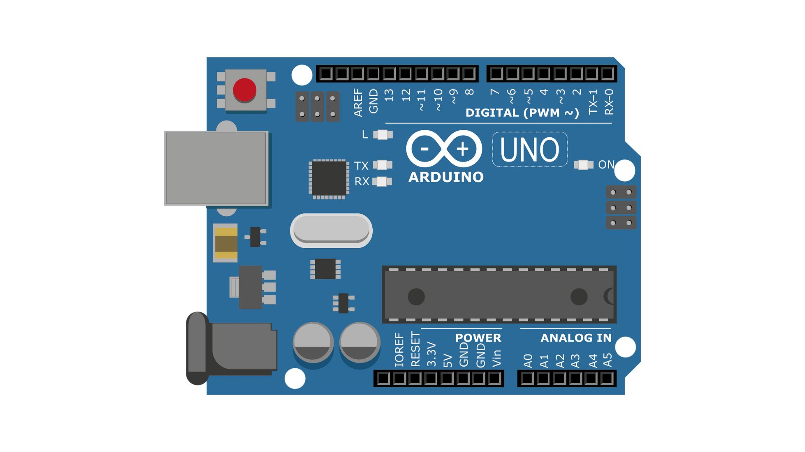
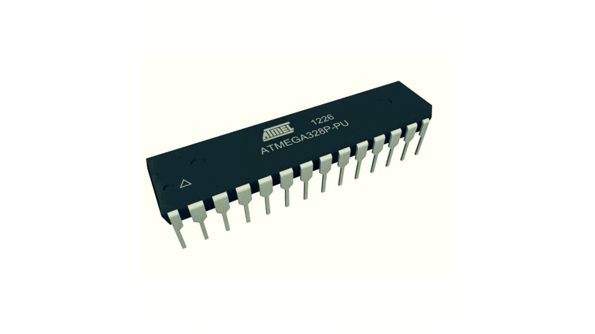
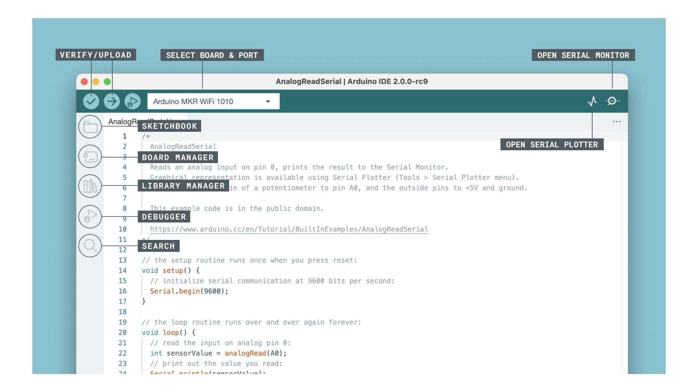
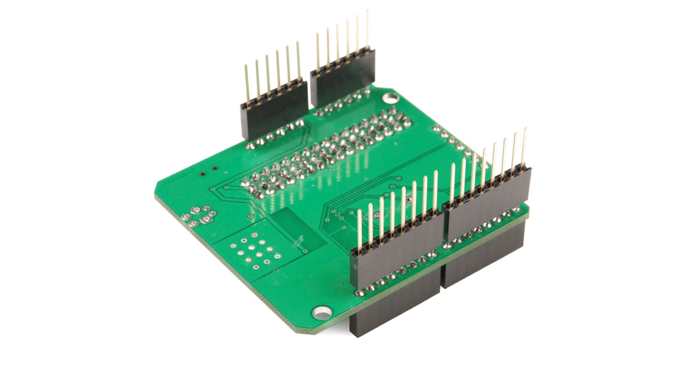

# Introduction to Arduino

Arduino is an open-source electronics platform known for its simplicity and versatility. Whether you're a hobbyist, student, artist, or professional, Arduino provides an accessible way to bring your electronic projects to life.

## Key Components

### 1. Arduino Board
The central component containing a microcontroller, the brain of the system.

### 2. Microcontroller
A small computer on the board responsible for executing uploaded programs.

### 3. IDE (Integrated Development Environment)
Software for coding, compiling, and uploading programs to the Arduino board.

*Image source: [Finder Website](https://opta.findernet.com/cs/tutorial/getting-started-ide-v2)*

### 4. Programming Language
   Arduino uses a simplified version of C/C++ with an easy-to-understand syntax.

### 5. Shield
Additional boards that extend Arduino's capabilities (e.g., Wi-Fi, sensors).

