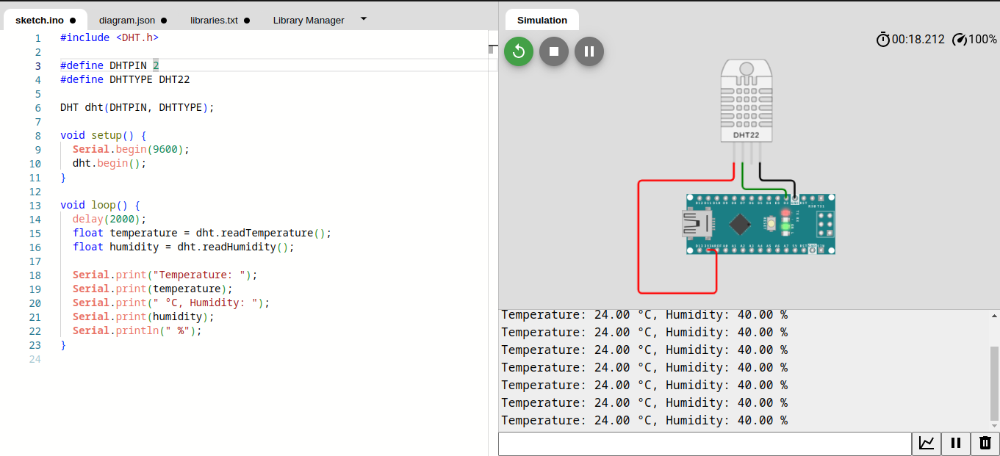
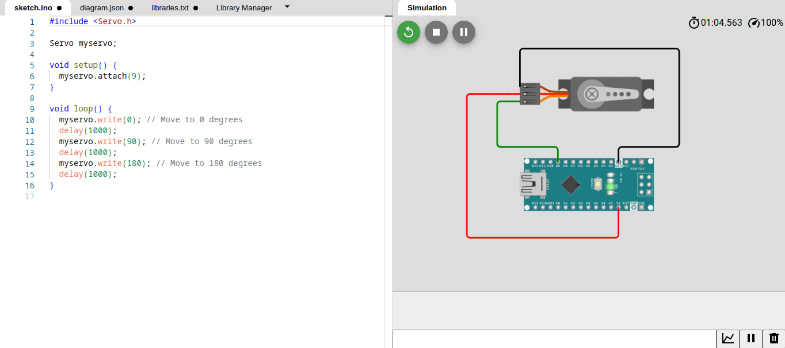
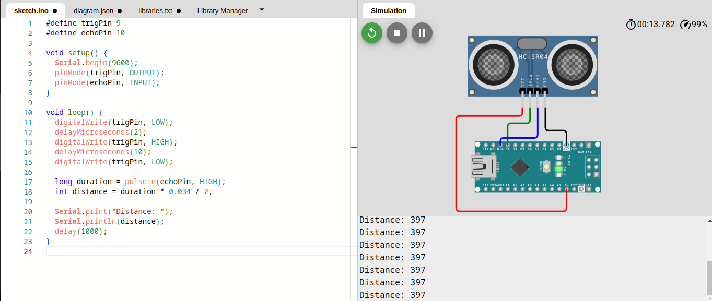
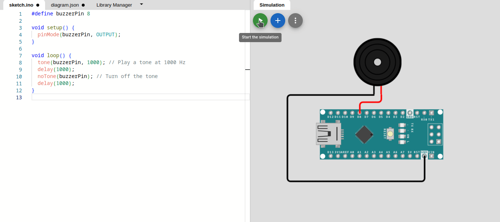

# Sensor Integration

## 1. DHT22 Temperature and Humidity Sensor
The DHT22 sensor is a versatile device capable of measuring temperature and humidity. It communicates with Arduino using a single-wire digital protocol.

Wiring:
- Connect the sensor's VCC pin to Arduino's 5V.
- Connect the sensor's GND pin to Arduino's GND.
- Connect the sensor's data pin to a digital input pin on Arduino.

```cpp
#include <DHT.h>

#define DHTPIN 2
#define DHTTYPE DHT22

DHT dht(DHTPIN, DHTTYPE);

void setup() {
  Serial.begin(9600);
  dht.begin();
}

void loop() {
  delay(2000);
  float temperature = dht.readTemperature();
  float humidity = dht.readHumidity();

  Serial.print("Temperature: ");
  Serial.print(temperature);
  Serial.print(" °C, Humidity: ");
  Serial.print(humidity);
  Serial.println(" %");
}
``````


## 2. Servo Motor
A servo motor is a rotary actuator that allows precise control of angular position. It is commonly used for controlling the movement of objects.

Wiring:
- Connect the servo's power (usually red) to Arduino's 5V.
- Connect the servo's ground (usually brown) to Arduino's GND.
- Connect the servo's signal (usually orange or yellow) to a PWM pin on Arduino.

```cpp
#include <Servo.h>

Servo myservo;

void setup() {
  myservo.attach(9);
}

void loop() {
  myservo.write(0); // Move to 0 degrees
  delay(1000);
  myservo.write(90); // Move to 90 degrees
  delay(1000);
  myservo.write(180); // Move to 180 degrees
  delay(1000);
}
``````


## 3. HC-SR04 Ultrasonic Distance Sensor
The HC-SR04 is an ultrasonic sensor that measures distance by emitting ultrasonic waves and calculating the time it takes for them to bounce back.

**How Does it Work?**

The ultrasonic sensor uses sonar to determine the distance to an object. Here’s what happens:

1. The ultrasound transmitter (trig pin) emits a high-frequency sound (40 kHz).
2. The sound travels through the air. If it finds an object, it bounces back to the module.
3. The ultrasound receiver (echo pin) receives the reflected sound (echo).

The time between the transmission and reception of the signal allows us to calculate the distance to an object. This is possible because we know the sound’s velocity in the air. Here’s the formula:
```
distance to an object = ((speed of sound in the air)*time)/2
```
speed of sound in the air at 20ºC (68ºF) = 343m/s


**Wiring:**
- Connect the sensor's VCC to Arduino's 5V.
- Connect the sensor's GND to Arduino's GND.
- Connect the sensor's Trig pin to a digital output pin on Arduino.
- Connect the sensor's Echo pin to a digital input pin on Arduino.

```cpp
#define trigPin 9
#define echoPin 10

void setup() {
  Serial.begin(9600);
  pinMode(trigPin, OUTPUT);
  pinMode(echoPin, INPUT);
}

void loop() {
  // The sensor is triggered by a HIGH pulse of 10 or more microseconds.
  // Give a short LOW pulse beforehand to ensure a clean HIGH pulse:
  digitalWrite(trigPin, LOW);
  delayMicroseconds(2);
  digitalWrite(trigPin, HIGH);
  delayMicroseconds(10);
  digitalWrite(trigPin, LOW);

  // Read the signal from the sensor: a HIGH pulse whose duration is the time (in microseconds) from the sending of the ping to the reception of its echo off of an object.
  // 0.0343 cm per microsecond.
  long duration = pulseIn(echoPin, HIGH);
  int distance = duration * 0.0343 / 2;

  Serial.print("Distance: ");
  Serial.println(distance);
  delay(1000);
}
``````


## 4. Buzzer for Auditory Feedback
A buzzer is an audio signaling device. It can be used to produce simple melodies or alert sounds.

Wiring:
- Connect the buzzer's positive (longer) pin to a digital output pin on Arduino.
- Connect the buzzer's negative (shorter) pin to Arduino's GND.

```cpp
#define buzzerPin 8

void setup() {
  pinMode(buzzerPin, OUTPUT);
}

void loop() {
  tone(buzzerPin, 1000); // Play a tone at 1000 Hz
  delay(1000);
  noTone(buzzerPin); // Turn off the tone
  delay(1000);
}
``````
