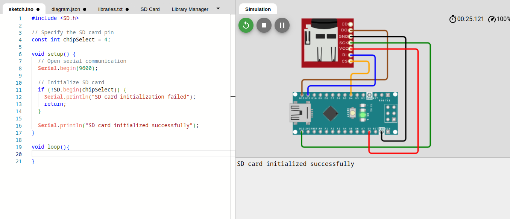

# Data Logging and SD Cards

## Introduction
Data logging is a crucial aspect of many applications, especially in scenarios where sensor data needs to be collected, stored, and later analyzed. One common and reliable method for this purpose is using SD (Secure Digital) cards. This document outlines the process of logging sensor data to an SD card and the subsequent steps for storing and retrieving the data for analysis.

## SPI communication protocol
SPI (Serial Peripheral Interface) is a synchronous serial communication protocol commonly used to transfer data between a master device (in this case, the Arduino) and one or more peripheral devices (such as an SD card module). 

- **MOSI (Master Out Slave In)**: This is the data line from the master to the peripheral. The master sends data to the peripheral on this line.

- **MISO (Master In Slave Out)**: This is the data line from the peripheral to the master. The peripheral sends data back to the master on this line.

- **SCK (Serial Clock)**: This is the clock signal generated by the master to synchronize data transmission between the master and the peripheral.

- **SS/CS (Slave Select/Chip Select)**: This is a control line that the master uses to select a specific peripheral for communication. When SS/CS is low, the selected peripheral is active.

## SD Card Module to Arduino Nano:

- **VCC to 5V:** Connect the VCC pin on the SD card module to the 5V output on the Arduino.
- **GND to GND:** Connect the GND pin on the SD card module to any GND pin on the Arduino.
- **MOSI to Pin 11:** Connect the MOSI (Master Out Slave In) pin on the SD card module to digital pin 11 on the Arduino.
- **MISO to Pin 12:** Connect the MISO (Master In Slave Out) pin on the SD card module to digital pin 12 on the Arduino.
- **SCK to Pin 13:** Connect the SCK (Serial Clock) pin on the SD card module to digital pin 13 on the Arduino.
- **CS to Pin 4 (or any other digital pin):** Connect the CS (Chip Select) pin on the SD card module to any digital pin (e.g., pin 4) on the Arduino.
- **CD (Card Detect) and WP (Write Protect):** These pins are often not used. You can leave them unconnected or connect them based on your specific requirements.


## Logging Sensor Data to an SD Card

### 1. Initialize SD Card
Ensure that the SD card is properly inserted into the device. Initialize the SD card to prepare it for data storage.



```cpp
#include <SD.h>

// Specify the SD card pin
const int chipSelect = 4;

void setup() {
  // Open serial communication
  Serial.begin(9600);

  // Initialize SD card
  if (!SD.begin(chipSelect)) {
    Serial.println("SD card initialization failed");
    return;
  }

  Serial.println("SD card initialized successfully");
}

void loop(){
  
}
``````

### 2: Log Sensor Data
Read sensor data and log it to the SD card. Ensure proper formatting for easy retrieval and analysis.


```cpp
#include <SD.h>

// Specify the SD card pin
const int chipSelect = 4;

// log sensor data
void logSensorData(int sensorValue) {
  // Open the file for writing
  File dataFile = SD.open("wokwi.txt", FILE_WRITE);

  // Check if the file opened successfully
  if (dataFile) {
    // Write sensor data to the file
    dataFile.println(sensorValue);

    // Close the file
    dataFile.close();
    Serial.println("Data written to the SD card.");

  } else {
    Serial.println("Error opening file for writing");
  }
}


void setup() {
  // Open serial communication
  Serial.begin(9600);

  // Initialize SD card
  if (!SD.begin(chipSelect)) {
    Serial.println("SD card initialization failed");
    return;
  }

  Serial.println("SD card initialized successfully");

  // sensor data
  int temperature = 12;
  // write data
  logSensorData(temperature);

}

void loop(){

}
``````

### 3. Retrieve Data for Analysis
After logging data, retrieve it for analysis. This may involve transferring the SD card to a computer or using a communication interface to read the data.


```cpp
#include <SD.h>

// Specify the SD card pin
const int chipSelect = 4;

// log sensor data
void logSensorData(int sensorValue) {
  // Open the file for writing
  File dataFile = SD.open("wokwi.txt", FILE_WRITE);

  // Check if the file opened successfully
  if (dataFile) {
    // Write sensor data to the file
    dataFile.println(sensorValue);

    // Close the file
    dataFile.close();
    Serial.println("Data written to the SD card.");

  } else {
    Serial.println("Error opening file for writing");
  }
}

// retrieve and analyze data
void analyzeData() {
  // Open the file for reading
  File dataFile = SD.open("wokwi.txt");

  // Check if the file opened successfully
  if (dataFile) {
    // Read and print data from the file
    while (dataFile.available()) {
      Serial.println(dataFile.readStringUntil('\n'));
    }

    // Close the file
    dataFile.close();
  } else {
    Serial.println("Error opening file for reading");
  }
}


void setup() {
  // Open serial communication
  Serial.begin(9600);

  // Initialize SD card
  if (!SD.begin(chipSelect)) {
    Serial.println("SD card initialization failed");
    return;
  }

  Serial.println("SD card initialized successfully");

  // sensor data
  int temperature = 12;
  // write data
  logSensorData(temperature);
  analyzeData();

}

void loop(){

}
``````
