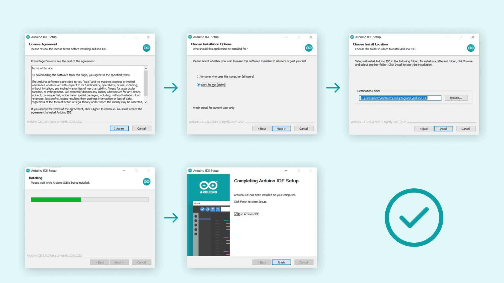

## Getting Started

1. **Download the Arduino IDE**
    - [Arduino Official Website](https://www.arduino.cc/)

2. **Install the Arduino IDE software**

    #### For Windows
    1. Run the downloaded installer (usually an executable file with a `.exe` extension).
    2. Follow the on-screen instructions to complete the installation.

   
   *Installation process on Windows. Image source: [Arduino Official Website](https://www.arduino.cc/en/software)*

    #### For macOS
    1. Open the downloaded .dmg file.
    2. Drag the Arduino IDE icon to your Applications folder.

    #### For Linux
    1. Extract the downloaded archive to your desired location.
    2. Run the install.sh script in the extracted folder.
    3. Follow any additional instructions provided during the installation.

3. **Connecting Your Arduino Board**
    - Use a USB cable to connect your Arduino board to your computer.
    - Select the appropriate Arduino board from the "Tools" menu.
    - Choose the correct port your Arduino is connected to from the "Tools" menu.

4. **Writing Your First Sketch (Program)**
    - Create a new sketch by clicking "File" and then "New."
    - Write your code in the integrated text editor.

    - sample code 
        ```cpp
        void setup() {
            // Start the serial communication
            Serial.begin(9600);
        }

        void loop() {
            // Print "Hello, World!" to the Serial Monitor
            Serial.println("Hello, World!");
            // Wait for a moment
            delay(1000);
        }
        ``````
4. **Compile Code**
    - Click the "Verify" button to check for syntax errors.

5. **Upload Code**
   - Click the "Upload" button to transfer your code to the Arduino board.

6. **Monitoring Serial Output**
   - Open the Serial Monitor to observe output.

## Sample Arduino Code

