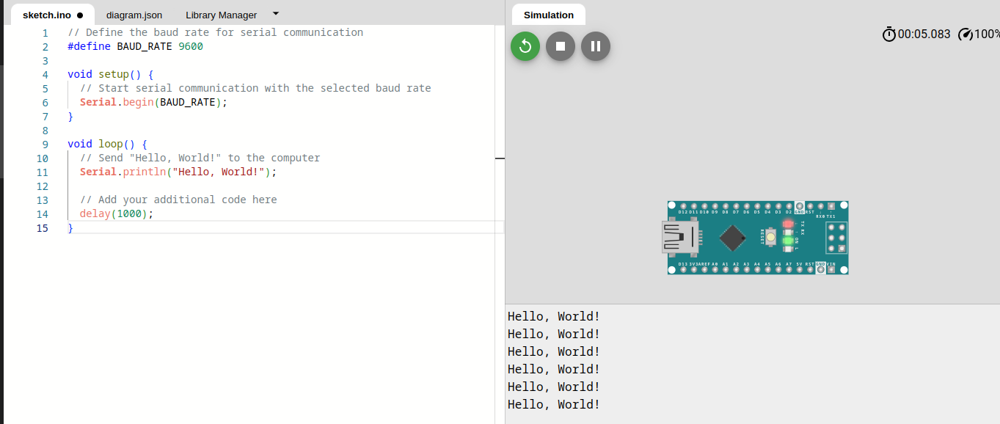
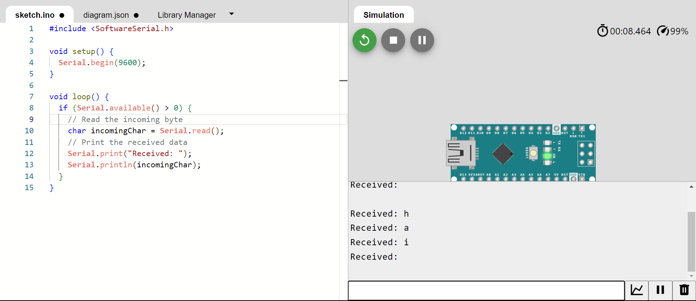

# Serial Communication between Arduino and Computer

In this tutorial, we will learn how to establish serial communication between an Arduino board and a computer. Serial communication is a fundamental aspect of Arduino programming, allowing data to be exchanged between the Arduino and your computer.

Serial communication involves the transmission of data one bit at a time over a communication channel. In the case of Arduino, this communication occurs over a USB cable between the Arduino board and your computer. The baud rate specifies the speed of the data transmission. Both the Arduino and the computer must use the same baud rate for successful communication. The Serial Monitor in the Arduino IDE allows you to view and send data for debugging and interaction with your Arduino projects.
## Prerequisites

Before starting, make sure you have the following:

- Arduino board
- USB cable
- Arduino IDE installed on your computer

## Step 1: Connect Arduino to Computer

Connect your Arduino board to your computer using a USB cable.

## Step 2: Open Arduino IDE

Open the Arduino IDE on your computer.

## Step 3: Open the Arduino Sketch

Create a new Arduino sketch or open an existing one.

## Step 4: Write Serial Communication Code
   
```cpp
// Define the baud rate for serial communication
#define BAUD_RATE 9600

void setup() {
  // Start serial communication with the selected baud rate
  Serial.begin(BAUD_RATE);
}

void loop() {
  // Send "Hello, World!" to the computer
  Serial.println("Hello, World!");

  // Add your additional code here
  delay(1000);
}
``````
## Step 5: Monitoring Serial Output
   - Open the Serial Monitor to observe output.


## Step 6: Read data from serial port
  

  ```cpp
void setup() { 
    Serial.begin(9600); 
} 
 
void loop() { 
    if (Serial.available() > 0) { 
      // Read the incoming byte 
      char incomingChar = Serial.read();  
      // Print the received data 
      Serial.print("Received: "); 
      Serial.println(incomingChar); 
    } 
}
  ``````