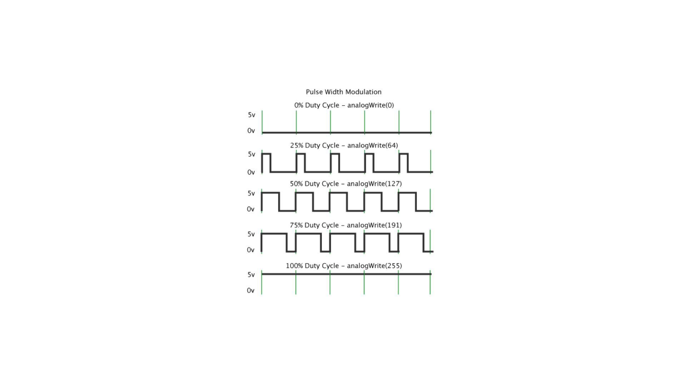

# Input and Output
In this tutorial, we will explore the fundamental concepts of Input and Output in Arduino. We'll cover interfacing with LEDs, reading from digital and analog pins, and controlling LED brightness using Pulse Width Modulation (PWM).

## 1. Interfacing LEDs
### 1.1 Turning on an LED
This Arduino code snippet defines a variable ledPin representing the digital pin (pin 13) to which an LED is connected. In the setup function, the ledPin is configured as an output, and the LED is turned on by setting the voltage on the pin to HIGH. The loop function is intentionally left empty, resulting in a continuous execution where the LED remains on without any additional actions. Essentially, the code initializes and powers on an LED connected to pin 13, demonstrating fundamental concepts such as pin configuration and digital output control in an Arduino sketch.

```cpp
// Define the LED pin
int ledPin = 13;

void setup() {
  // Set the LED pin as an output
  pinMode(ledPin, OUTPUT);
  // Turn the LED on
  digitalWrite(ledPin, HIGH);
}

void loop() {

}
``````

### 1.2 Blinking an LED
This code configures pin 13 as an output and toggles the LED state with a delay, creating a blinking effect.
```cpp
// Define the LED pin
int ledPin = 13;

void setup() {
  // Set the LED pin as an output
  pinMode(ledPin, OUTPUT);
}

void loop() {
  // Turn the LED on
  digitalWrite(ledPin, HIGH);
  delay(1000); // Wait for 1 second

  // Turn the LED off
  digitalWrite(ledPin, LOW);
  delay(1000); // Wait for 1 second
}
``````

## 2. Reading from Digital and Analog Pins

### 2.1 Digital Pin Reading

- When `digitalRead()` is called on a specific pin, it reads the voltage level on that pin.
- If the voltage is closer to 0 volts, the function returns LOW (which is represented as a numerical value of 0).
- If the voltage is closer to the operating voltage (typically 5 volts on Arduino boards), the function returns HIGH (which is represented as a numerical value of 1).


```cpp
// Define digital input pin
int digitalInputPin = 2;

void setup() {
  // Set the digital input pin as an input
  pinMode(digitalInputPin, INPUT);
}

void loop() {
  // Read the digital input
  int digitalValue = digitalRead(digitalInputPin);

  // Print the result to the Serial Monitor
  Serial.println("Digital Input: " + String(digitalValue));

  delay(1000); // Wait for 1 second
}

``````
### 2.2 Reading from an Analog Pin

- analogRead() reads the voltage level on the specified analog pin.
- It converts the analog voltage, which can range from 0 to the reference voltage (typically 5 volts on Arduino boards), into a digital value.
- The result is a numerical value between 0 (representing 0 volts) and 1023 (representing the reference voltage).

```cpp
// Define analog input pin
int analogInputPin = A0;

void setup() {
  // No setup needed for analog input
}

void loop() {
  // Read the analog input
  int analogValue = analogRead(analogInputPin);

  // Print the result to the Serial Monitor
  Serial.println("Analog Input: " + String(analogValue));

  delay(1000); // Wait for 1 second
}
``````
## 3. Controlling LED Brightness with PWM
Pulse Width Modulation (PWM) allows us to control the brightness of an LED. Let&rsquo;s control the brightness of an LED using PWM:
```cpp
// Define the LED pin and a variable for brightness
int ledPin = 9;
int brightness = 0;

void setup() {
  // Set the LED pin as an output
  pinMode(ledPin, OUTPUT);
}

void loop() {
  // Increase brightness
  for (brightness = 0; brightness <= 255; brightness += 5) {
    analogWrite(ledPin, brightness);
    delay(50);
  }

  // Decrease brightness
  for (brightness = 255; brightness >= 0; brightness -= 5) {
    analogWrite(ledPin, brightness);
    delay(50);
  }
}
``````
This code gradually increases and decreases the LED brightness using PWM on pin 9.

### Here's a breakdown of how PWM works:

*Basics of PWM (Pulse Width Modulation). Image source: [Arduino Official Website](https://docs.arduino.cc/learn/microcontrollers/analog-output)*

1. Digital Approximation of Analog Signal:
    - In digital systems like Arduino, outputs are either fully on (HIGH or 1) or fully off (LOW or 0).
    - PWM achieves the effect of an analog signal by rapidly switching the output between HIGH and LOW states.
2. Pulse Width:
    - PWM involves varying the width of the HIGH state pulses over time while maintaining a constant frequency.
    - The ratio of the time the signal is HIGH to the total time of one cycle is known as the duty cycle.
3. Duty Cycle and Intensity/Speed Control:
    - The duty cycle represents the percentage of time the signal is HIGH within one cycle.
    - Higher duty cycles mean the signal is ON for a longer duration, simulating a higher average voltage.
    - For example, in LED control, a higher duty cycle results in a brighter light.
4. Arduino PWM:
    - Arduino boards have dedicated PWM pins, allowing for easy implementation of PWM signals.
    - Functions like analogWrite() in Arduino use PWM to control the intensity of an attached device.
    - Common PWM-enabled pins on Arduino boards include those labeled with a tilde (~) symbol (e.g., ~3, ~5, ~6).
5. Applications:
    - PWM is widely used in motor control, LED brightness adjustment, servo motor positioning, and other scenarios requiring variable output.
    
