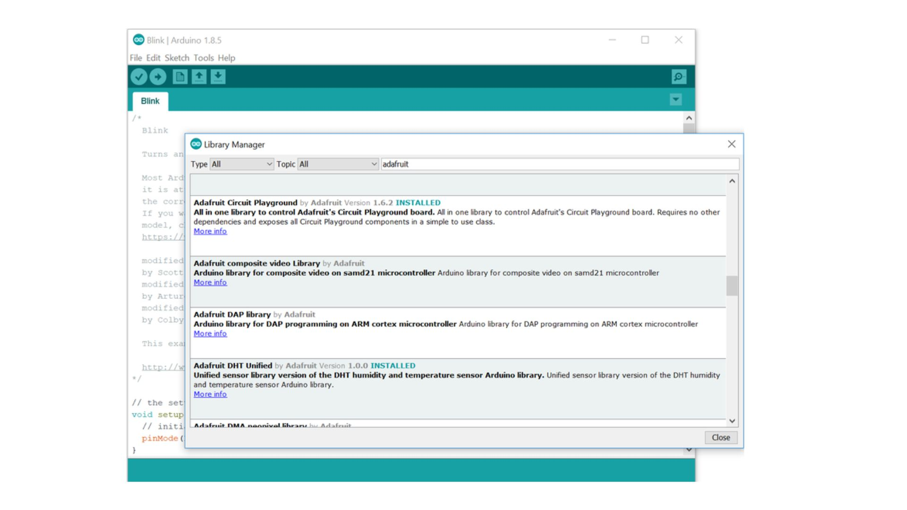

# Arrays, Strings, Functions and Libraries


## 1. Arrays

Arrays are essential data structures that allow you to store and manipulate a collection of values under a single variable name. They are particularly useful for managing sets of data efficiently.

#### Declaring Arrays

You can declare an array in Arduino using the following syntax:

```cpp
void setup() {
  Serial.begin(9600);
  // Syntax: data_type array_name[array_size];
  int myArray[5]; // Declares an integer array of size 5
}

void loop() {
}
``````

#### Initializing Arrays

Arrays can be initialized at the time of declaration or later in your code

```cpp
void setup() {
  Serial.begin(9600);
  int myNumbers[] = {1, 2, 3, 4, 5}; // Initializing at declaration

  // Initializing later
  int anotherArray[3];
  anotherArray[0] = 10;
  anotherArray[1] = 20;
  anotherArray[2] = 30;
}

void loop() {
}

``````

#### Accessing Array Elements

You can access individual elements in an array using their index, starting from 0

```cpp
void setup() {
  Serial.begin(9600);

  // Initializing at declaration
  int myNumbers[] = {1, 2, 3, 4, 5}; 
  // Retrieves the third element (index 2) in myNumbers
  int value = myNumbers[2]; 
  Serial.println(value);

}

void loop() {
}
``````

#### Modifying Array Elements

You can modify the values of array elements similarly

```cpp
void setup() {
  Serial.begin(9600);

  // Initializing at declaration
  int myNumbers[] = {1, 2, 3, 4, 5}; 
  // Changes the value of the second element in myNumbers to 100
  myNumbers[1] = 100; 
  Serial.println(myNumbers[1]);

}

void loop() {
}
``````

#### Iterating Through Arrays

Loop structures are commonly used to iterate through array elements:

```cpp
void setup() {
  Serial.begin(9600);

  // Initializing at declaration
  int myNumbers[] = {1, 2, 3, 4, 5}; 

  for (int i = 0; i < 5; i++) {
    Serial.println(myNumbers[i]);
  }
  
}

void loop() {
}
``````
#### Multidimensional Arrays

Arduino also supports multidimensional arrays for organizing data in multiple dimensions:

```cpp
void setup() {
  Serial.begin(9600);

  // Initializing at declaration
  int matrix[3][3] = {{1, 2, 3}, {4, 5, 6}, {7, 8, 9}};
  // Loop through the matrix diagonally and print each diagonal element
  for (int i = 0; i < 3; i++) {
    // Print the diagonal element at position (i, i)
    Serial.println(matrix[i][i]);
  }
  
}

void loop() {
}
``````

## 2. Strings

In Arduino programming, strings are sequences of characters that represent textual data. Understanding how to declare, manipulate, and work with strings is essential for various applications, including communication with sensors, displays, and external devices.

#### Declaring and Initializing Strings

Strings in Arduino can be declared and initialized using the `String` class:

```cpp
void setup() {
  Serial.begin(9600);
  String greeting = "Hello, Arduino!";
  Serial.println(greeting);
}

void loop() {
}
``````

#### String Concatenation
```cpp
void setup() {
  Serial.begin(9600);

  String name = "Arduino";
  String message = "Welcome to " + name + "!";
  Serial.println(message);  
}

void loop() {
}
``````

#### Accessing Characters in a String
Individual characters in a string can be accessed using the charAt() method
```cpp
void setup() {
  Serial.begin(9600);

  String name = "Arduino";
  char firstChar = name.charAt(0);
  Serial.println(firstChar);  
}

void loop() {
}
``````

#### String Comparison
You can compare strings in Arduino using the equals() method
```cpp
void setup() {
  Serial.begin(9600);

  String userInput = "Password123";
  String correctPassword = "Password123";

  if (userInput.equals(correctPassword)) {
    Serial.println("Passwords match");
  } else {
    Serial.println("Passwords do not match");
  }
}

void loop() {
}
``````

#### String Length
To get the length of a string in Arduino, you can use the length() method
```cpp
void setup() {
  Serial.begin(9600);

  String value = "Password123";
  int stringLength = value.length();
  Serial.println(stringLength);
}

void loop() {
}
``````

#### String Conversion
Arduino allows converting numerical values to strings using the String() constructor
```cpp
void setup() {
  Serial.begin(9600);
  int value = 42;
  String stringValue = String(value);
  Serial.println(stringValue);
}

void loop() {
}

``````

## 3. Functions and their Implementation

Arduino programming allows you to organize your code into functions, making it modular and easier to manage. In this guide, we'll explore the basics of functions in Arduino and how to implement them effectively.

### Introduction to Functions

In Arduino programming, a function is a reusable block of code that performs a specific task. It helps in breaking down a program into smaller, manageable parts, promoting code readability and reusability.

### Syntax of a Function

The basic syntax of a function in Arduino is as follows:

```cpp
return_type function_name(parameter_type parameter_name) {
  // Function body
  // Code to perform the task
  return result; // Optional return statement
}
``````

### Calling a Function
To use a function, you need to call it from the main program or another function. Here&rsquo;s how you call the addNumbers function:
```cpp
int addNumbers(int a, int b) {
  int sum = a + b;
  return sum;
}

void setup() {
  // Your setup code here
}

void loop() {
  int result = addNumbers(5, 3);
  // Now 'result' holds the sum of 5 and 3
}
``````

### Types of Functions in Arduino

Arduino programming involves various types of functions, categorized based on return types and parameters. Understanding these distinctions is essential for crafting effective and modular code.

#### 1. Functions with Return Types

Functions that return a value based on a specified data type.

```cpp
int add(int a, int b) {
  return a + b;
}
``````
#### 2. Functions without Return Types

Functions that do not return any value, often used for tasks without specific outputs.

```cpp
void printMessage() {
  Serial.println("Hello, Arduino!");
}
``````

#### 3. Functions with Parameters

Functions that take parameters (input values) to perform tasks requiring external data.

```cpp
void blinkLED(int pin, int duration) {
  digitalWrite(pin, HIGH);
  delay(duration);
  digitalWrite(pin, LOW);
}
``````
#### 4. Functions without Parameters

Functions that do not require external input parameters.

```cpp
void setup() {
  // Setup code
}

void loop() {
  // Loop code
}
``````

## 4. Libraries
Libraries in Arduino are pre-written code modules that provide additional functionalities to your sketches. They enable you to easily include complex features such as sensors, displays, communication protocols, and more without having to write the code from scratch.

#### Understanding Arduino Libraries

Arduino libraries consist of functions and procedures encapsulated in a set of files. They simplify complex tasks and allow for code reusability across different projects.

#### Using Built-in Libraries

Arduino comes with a set of built-in libraries that cover a wide range of functionalities. These libraries are included automatically when needed. Common built-in libraries include `Wire` for I2C communication, `Serial` for serial communication, and `Servo` for controlling servo motors.

```cpp
#include <Wire.h>  // Include the Wire library for I2C communication
``````

#### Installing External Libraries
For additional functionalities, you can install external libraries created by the Arduino community or other developers. This is done through the Arduino Library Manager, accessible from the Arduino IDE.
- Open the Arduino IDE.
- Navigate to Sketch > Include Library > Manage Libraries...
- In the Library Manager, you can search, install, and manage external libraries.



