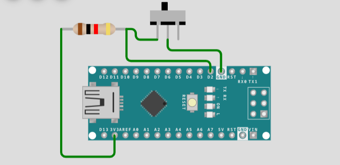
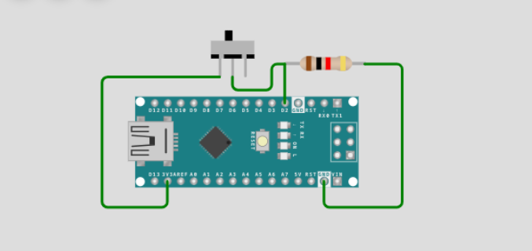
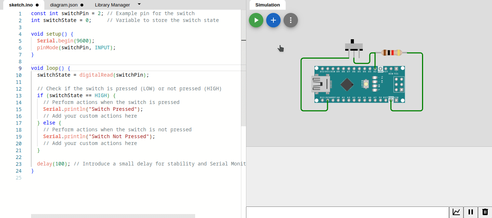
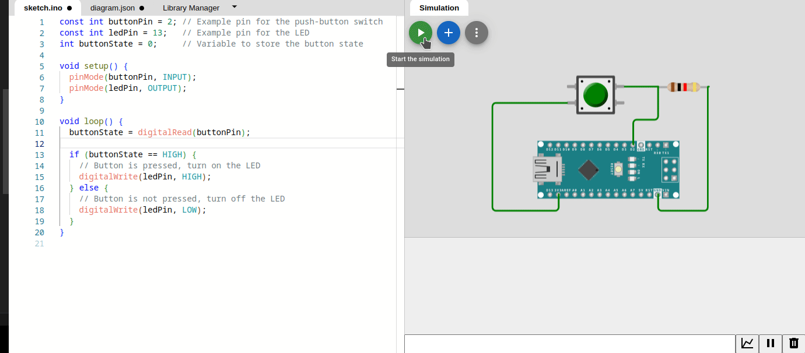
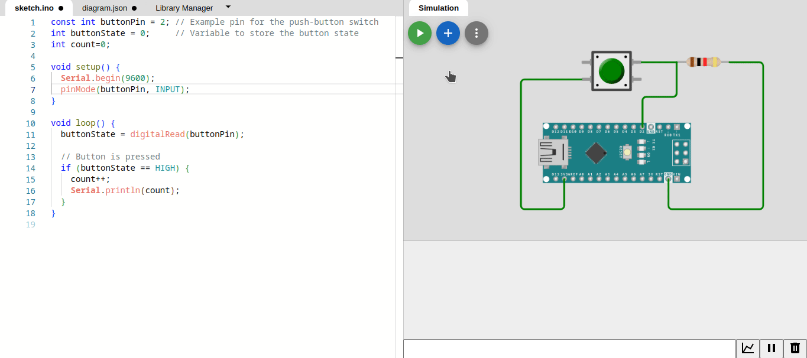
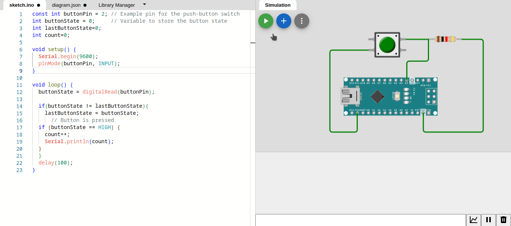

# Interfacing with Switches and Buttons

Interfacing switches and buttons with Arduino involves understanding digital inputs, debouncing techniques, and implementing various types of switches. This is a fundamental aspect of hardware interaction in Arduino projects.

### Understanding Digital Inputs

In Arduino, digital inputs are used to read the state of a switch or button. Digital inputs can only have two states: HIGH (1) or LOW (0). Understanding how to use digital inputs is essential for detecting the state of a switch in your projects.

### Pull-up and pull-down resistors
Pull-up and pull-down resistors are commonly used in electronic circuits to ensure a stable voltage level at a particular pin when it is not actively being driven by an external signal. They are often used with switches or other digital input devices to prevent the input pin from floating (having an undefined voltage level) when not actively being driven by an external signal.

#### - Pull-Up Resistor:

- A pull-up resistor is connected between the signal pin and the voltage source (usually Vcc, which is the supply voltage). It "pulls up" the voltage level of the signal pin when the external device is not actively driving it.
- When the switch is open, the pull-up resistor pulls the signal pin to HIGH.
- When the switch is closed, the external device drives the signal pin to LOW, overcoming the pull-up resistor.
```cpp
pinMode(buttonPin, INPUT_PULLUP);
``````


#### - Pull-Down Resistor:

- A pull-down resistor is connected between the signal pin and the ground (GND). It "pulls down" the voltage level of the signal pin when the external device is not actively driving it.
- When the switch is open, the pull-down resistor pulls the signal pin to LOW.
- When the switch is closed, the external device drives the signal pin to HIGH, overcoming the pull-down resistor.
```cpp
pinMode(buttonPin, INPUT_PULLDOWN);
``````


### 1. Implementing Switches

```cpp
const int switchPin = 2; // Example pin for the switch
int switchState = 0;     // Variable to store the switch state

void setup() {
  Serial.begin(9600);
  pinMode(switchPin, INPUT);
}

void loop() {
  switchState = digitalRead(switchPin);

  // Check if the switch is pressed (LOW) or not pressed (HIGH)
  if (switchState == HIGH) {
    // Perform actions when the switch is pressed
    Serial.println("Switch Pressed");
    // Add your custom actions here
  } else {
    // Perform actions when the switch is not pressed
    Serial.println("Switch Not Pressed");
    // Add your custom actions here
  }

  delay(100); // Introduce a small delay for stability and Serial Monitor readability
}
``````



### 2. Implementing Push-Button Switches

A push-button switch is a momentary switch that is pressed to make a connection and released to break the connection. Implementing push-button switches involves reading their state and responding to the transitions from HIGH to LOW or vice versa.

```cpp
const int buttonPin = 2; // Example pin for the push-button switch
const int ledPin = 13;   // Example pin for the LED
int buttonState = 0;     // Variable to store the button state

void setup() {
  pinMode(buttonPin, INPUT);
  pinMode(ledPin, OUTPUT);
}

void loop() {
  buttonState = digitalRead(buttonPin);

  if (buttonState == HIGH) {
    // Button is pressed, turn on the LED
    digitalWrite(ledPin, HIGH);
  } else {
    // Button is not pressed, turn off the LED
    digitalWrite(ledPin, LOW);
  }
}
``````



###  3. Simple demonstration of switch bouncing
When you press the button, you may see multiple count increments in the Serial Monitor due to bouncing. 
```cpp
const int buttonPin = 2; // Example pin for the push-button switch
int buttonState = 0;     // Variable to store the button state
int count=0;

void setup() {
  Serial.begin(9600);
  pinMode(buttonPin, INPUT);
}

void loop() {
  buttonState = digitalRead(buttonPin);

  // Button is pressed
  if (buttonState == HIGH) {
    count++;
    Serial.println(count);
  }
}
``````

 


### 4. Debouncing
Debouncing is removing unwanted input noise from buttons, switches or other user input. Debouncing prevents extra activations or slow functions from triggering too often. Debouncing is used in hardware switches, programs and websites.

Pushbuttons often generate spurious open/close transitions when pressed, due to mechanical and physical issues: these transitions may be read as multiple presses in a very short time fooling the program. Without debouncing, pressing the button once may cause unpredictable results. 


###  Button Press Counter with Debounce Logic

```cpp
const int buttonPin = 2; // Example pin for the push-button switch
int buttonState = 0;     // Variable to store the button state
int lastButtonState = 0;
int count = 0;

void setup() {
  Serial.begin(9600);
  pinMode(buttonPin, INPUT);
}

void loop() {
  buttonState = digitalRead(buttonPin);

  if (buttonState != lastButtonState) {
    lastButtonState = buttonState;
    // Button is pressed
    if (buttonState == HIGH) {
      count++;
      Serial.println(count);
    }
  }
  delay(100);
}
``````

 


