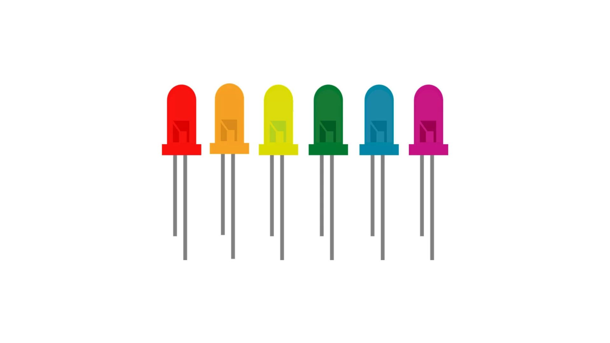
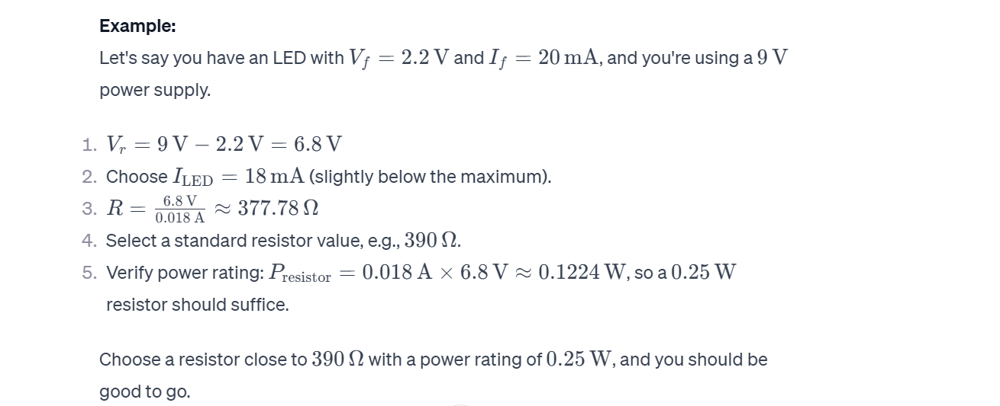

# LED Interfacing and Resistor Calculation

### Understanding the Importance of Current-Limiting Resistors

When interfacing LEDs with Arduino pins, it's crucial to include current-limiting resistors in the circuit. LEDs have specific forward voltages and forward currents at which they operate optimally. Without a current-limiting resistor, excessive current can flow through the LED, potentially damaging both the LED and the Arduino pin.

### Calculating Resistor Values for Safe LED Operation with Arduino Pins

To calculate the current-limiting resistor value, you can use Ohm's Law:

R = (V_source - V_LED) / I_LED

Where:
- R is the resistance in ohms.
- V_source is the source voltage (Arduino pin voltage, typically 5V).
- V_LED is the forward voltage drop across the LED.
- I_LED is the desired LED current.

Let's assume:
- V_source = 5 volts (Arduino HIGH level voltage).
- V_LED is the forward voltage of your LED (check the datasheet).
- I_LED is the desired LED current (choose a safe value, e.g., 10-20 mA for standard LEDs).

### Color,Forward Voltage (V) of standard LEDs

* Red: 1.7-2.0 V
* Orange: 2.0-2.2 V
* Yellow: 2.1-2.3 V
* Green: 2.2-2.4 V
* Blue: 3.0-3.3 V
* White: 3.0-3.4 V

