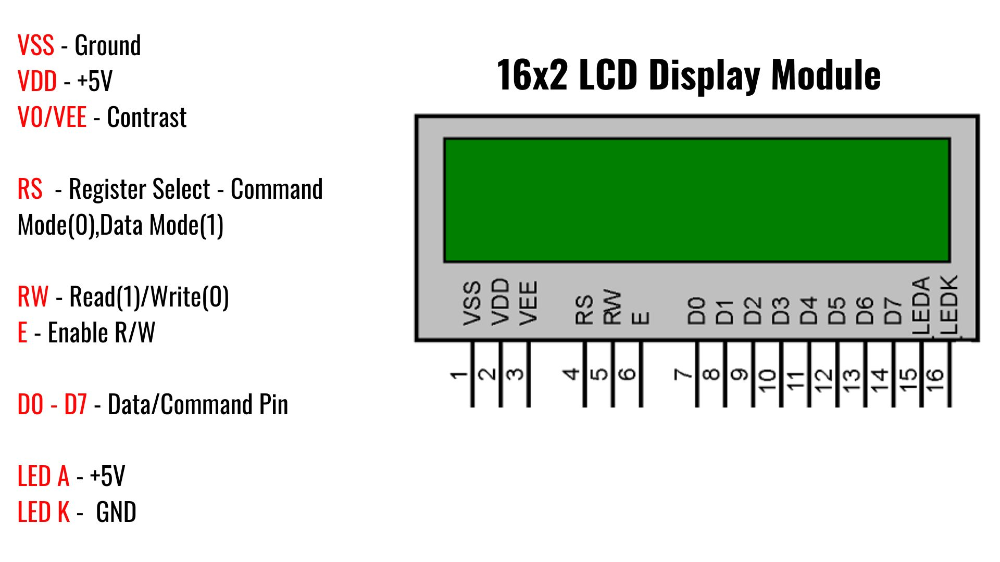
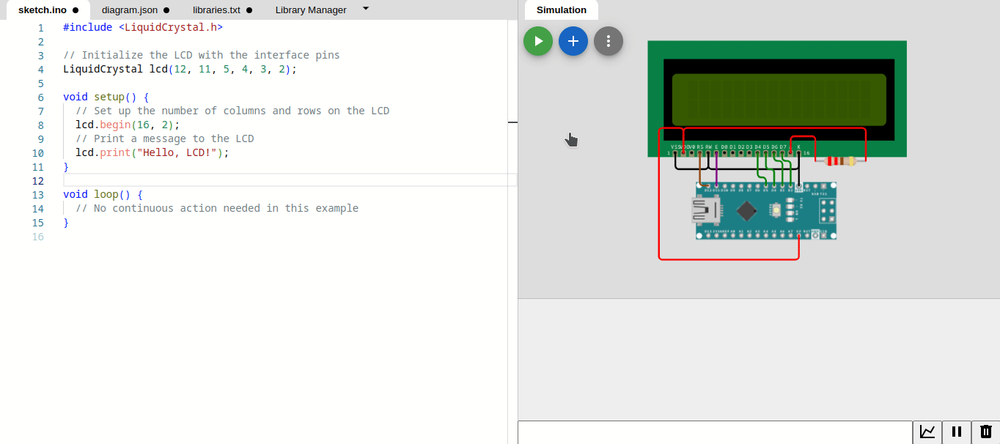
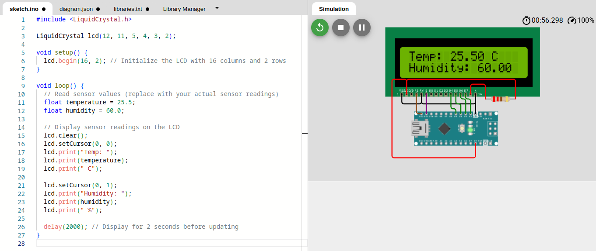
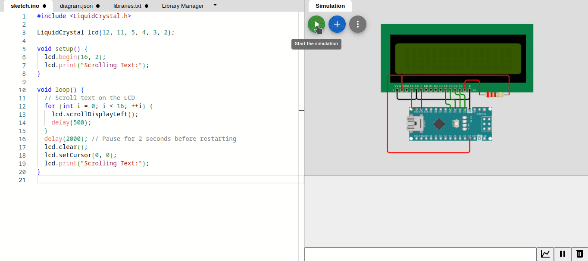
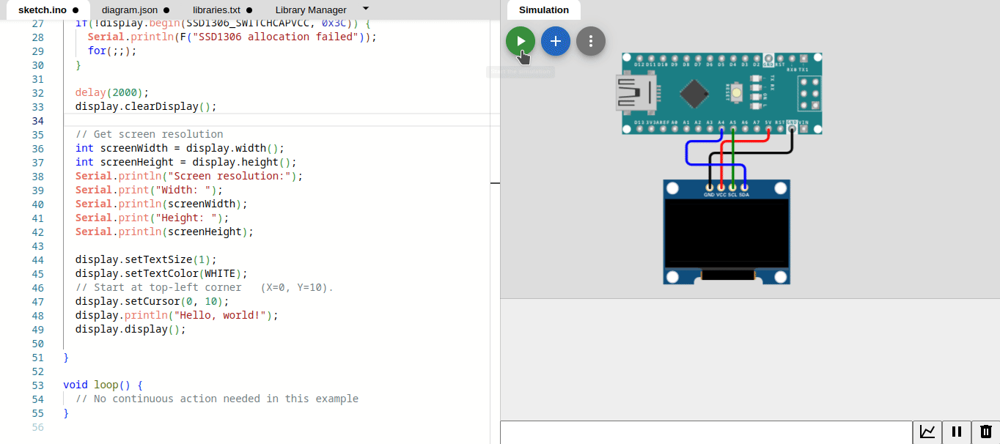
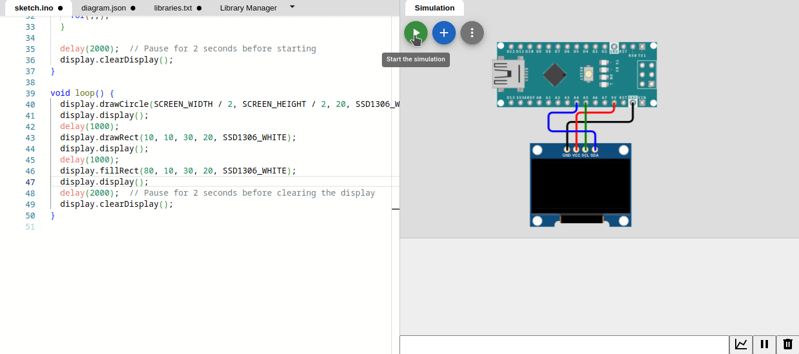

# Interfacing with Displays

## 1. LCD (Liquid Crystal Display)
Interfacing with LCDs (Liquid Crystal Displays) involves connecting the display to an Arduino and utilizing a library to control the display. LCDs are commonly used for visual output in various projects.


```
LCD Pin    Arduino Nano Pin
-------    ----------------
1 (VSS)           GND
2 (VDD)           +5V
3 VEE (Contrast) Potentiometer Out,  Not connected (leave empty)
4 (RS)            D12
5 (RW)            GND
6 (EN)            D11
7, 8, 9, 10 Not connected (leave empty)
11 (D4)           D5
12 (D5)           D4
13 (D6)           D3
14 (D7)           D2
15 LED A(+)       3.3V (Backlight)
16 LED K(-)       GND (Backlight)

```

```cpp
#include <LiquidCrystal.h>

// Initialize the LCD with the interface pins
LiquidCrystal lcd(12, 11, 5, 4, 3, 2);

void setup() {
  // Set up the number of columns and rows on the LCD
  lcd.begin(16, 2);
  // Print a message to the LCD
  lcd.print("Hello, LCD!");
}

void loop() {
  // No continuous action needed in this example
}
``````


### Example 1: Displaying Sensor Readings on LCD
```cpp
#include <LiquidCrystal.h>

LiquidCrystal lcd(12, 11, 5, 4, 3, 2);

void setup() {
  lcd.begin(16, 2); // Initialize the LCD with 16 columns and 2 rows
}

void loop() {
  // Read sensor values (replace with your actual sensor readings)
  float temperature = 25.5;
  float humidity = 60.0;

  // Display sensor readings on the LCD
  lcd.clear();
  lcd.setCursor(0, 0);
  lcd.print("Temp: ");
  lcd.print(temperature);
  lcd.print(" C");

  lcd.setCursor(0, 1);
  lcd.print("Humidity: ");
  lcd.print(humidity);
  lcd.print(" %");

  delay(2000); // Display for 2 seconds before updating
}

``````


### Example 2: Scrolling Text on LCD
```cpp
#include <LiquidCrystal.h>

LiquidCrystal lcd(12, 11, 5, 4, 3, 2);

void setup() {
  lcd.begin(16, 2);
  lcd.print("Scrolling Text:");
}

void loop() {
  // Scroll text on the LCD
  for (int i = 0; i < 16; ++i) {
    lcd.scrollDisplayLeft();
    delay(500);
  }
  delay(2000); // Pause for 2 seconds before restarting
  lcd.clear();
  lcd.setCursor(0, 0);
  lcd.print("Scrolling Text:");
}
``````



## 2. OLED (Organic Light-Emitting Diode) Display
Interfacing with OLED displays involves connecting the display to an Arduino and utilizing a library to control the display. OLEDs are known for their bright and high-contrast displays, making them suitable for various projects.

Connecting an OLED display to an Arduino typically involves using the I2C (Inter-Integrated Circuit) communication protocol. OLED displays often come in different resolutions (e.g., 128x64 pixels).

Connect VCC and GND:

- Connect the VCC pin of the OLED display to the 5V output on the Arduino.
- Connect the GND pin of the OLED display to any GND pin on the Arduino.

Connect SDA and SCL:

- Connect the SDA pin of the OLED display to the A4 (SDA) pin on the Arduino.
- Connect the SCL pin of the OLED display to the A5 (SCL) pin on the Arduino.



```cpp
#include <Wire.h>
#include <Adafruit_GFX.h>
#include <Adafruit_SSD1306.h>

/*
Connections
-------------
VCC - 5V
GND - GND
SDA - A4
SCL - A5
*/

#define SCREEN_WIDTH 128
#define SCREEN_HEIGHT 64

// Reset pin ( -1 if sharing Arduino reset pin)
#define OLED_RESET   -1 

// Initialize the OLED display with the I2C address
Adafruit_SSD1306 display(SCREEN_WIDTH, SCREEN_HEIGHT, &Wire, OLED_RESET);

void setup() {
  Serial.begin(9600);
  // SSD1306_SWITCHCAPVCC = generate display voltage from 3.3V internally
  // Address -  0x3C
  if(!display.begin(SSD1306_SWITCHCAPVCC, 0x3C)) {
    Serial.println(F("SSD1306 allocation failed"));
    for(;;);
  }

  delay(2000);
  display.clearDisplay();

  // Get screen resolution
  int screenWidth = display.width();
  int screenHeight = display.height();
  Serial.println("Screen resolution:");
  Serial.print("Width: ");
  Serial.println(screenWidth);
  Serial.print("Height: ");
  Serial.println(screenHeight);

  display.setTextSize(1);
  display.setTextColor(WHITE);
  // Start at top-left corner   (X=0, Y=10).
  display.setCursor(0, 10);
  display.println("Hello, world!");
  display.display();

}

void loop() {
  // No continuous action needed in this example
}
``````
### Drawing Shapes on OLED

```cpp
#include <Wire.h>
#include <Adafruit_GFX.h>
#include <Adafruit_SSD1306.h>

/*
Connections
-------------
VCC - 5V
GND - GND
SDA - A4
SCL - A5
*/

#define SCREEN_WIDTH 128
#define SCREEN_HEIGHT 64

// Reset pin ( -1 if sharing Arduino reset pin)
#define OLED_RESET   -1 

// Initialize the OLED display with the I2C address
Adafruit_SSD1306 display(SCREEN_WIDTH, SCREEN_HEIGHT, &Wire, OLED_RESET);


void setup() {
  Serial.begin(9600);
  while (!Serial);

  // SSD1306_SWITCHCAPVCC = generate display voltage from 3.3V internally
  // Address -  0x3C
  if(!display.begin(SSD1306_SWITCHCAPVCC, 0x3C)) {
    Serial.println(F("SSD1306 allocation failed"));
    for(;;);
  }

  delay(2000);  // Pause for 2 seconds before starting
  display.clearDisplay();
}

void loop() {
  display.drawCircle(SCREEN_WIDTH / 2, SCREEN_HEIGHT / 2, 20, SSD1306_WHITE);
  display.display();
  delay(1000);
  display.drawRect(10, 10, 30, 20, SSD1306_WHITE);
  display.display();
  delay(1000);
  display.fillRect(80, 10, 30, 20, SSD1306_WHITE);
  display.display();
  delay(2000);  // Pause for 2 seconds before clearing the display
  display.clearDisplay();
}
``````


